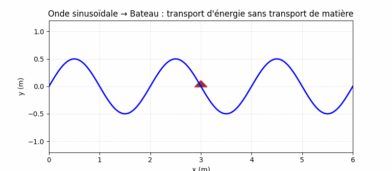
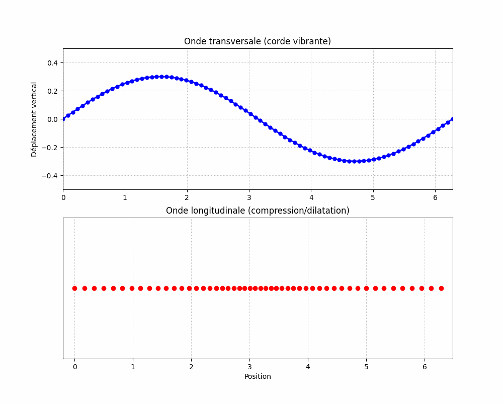
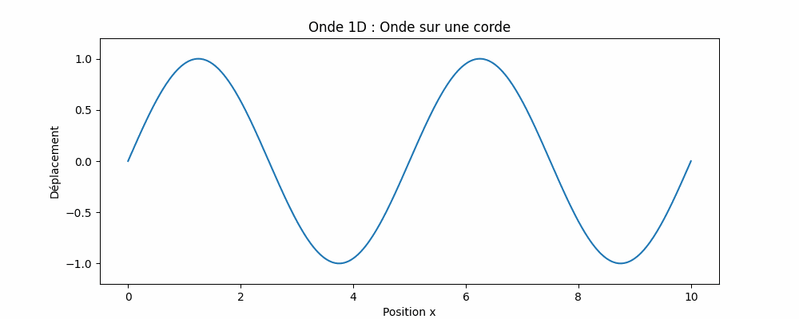
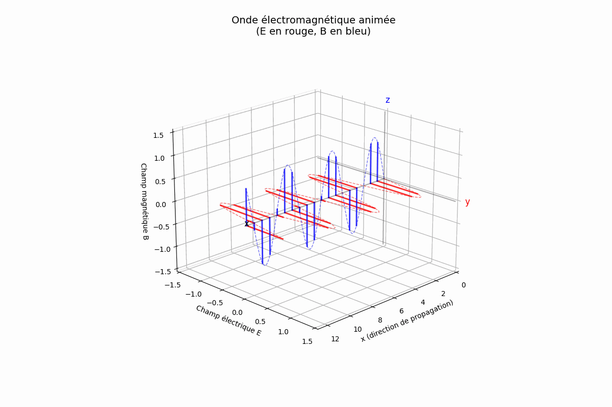
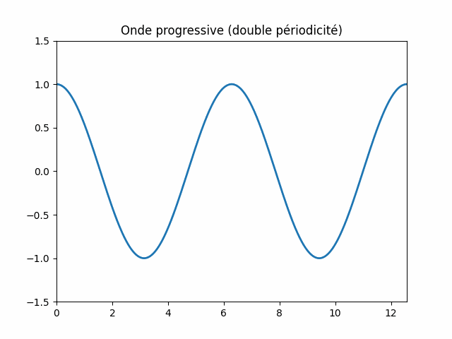
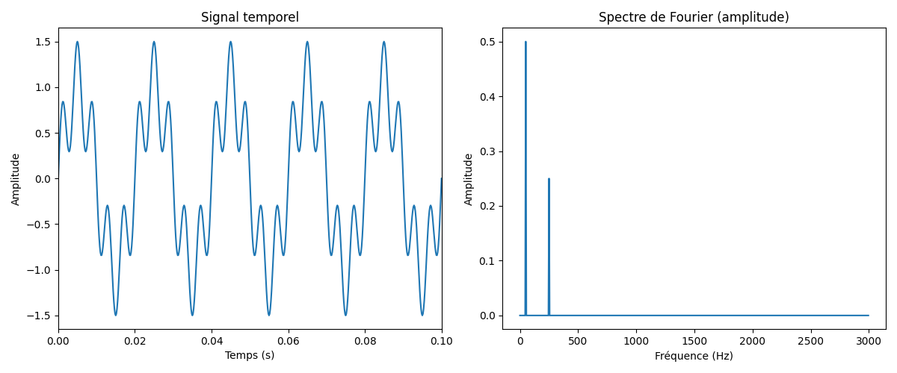

# Chapitre #1 - Propagation d'un signal sinusoïdale
## 1- Notion
En physique, une **onde** est une perturbation (dans notre cas périodique) qui se propage dans l’espace et/ou le temps, transportant de l’énergie **sans transport global de matière** (cf. animation Bateau & vague - Transport d'energie sans transport de matière).

Elle résulte souvent d’une variation/perturbation périodique d’une grandeur physique (position, pression, champ électrique, etc.) et peut se propager :

Dans un milieu matériel -> *onde mécanique* : 
- Ondes à la surface de l’eau
- Ondes sismiques (dans la croûte terrestre)
- Ondes sonores (dans l’air, l’eau, etc.)

Sans support matériel -> *onde électromagnétique* :
- Lumière visible
- Rayons infrarouges, ultraviolets
- Rayons X, gamma
- Ondes radio

## 2- Caractérisation d'une onde
La perturbation associée à une onde est décrite par une grandeur physique caractéristique, notée en général u(x, t), qui dépend de la position x et du temps t.

Cette grandeur caractéristique représente ce qui est perturbé localement dans le milieu (ou dans le champ) au passage de l'onde. Elle varie dans le temps et dans l’espace au rythme de la propagation.

### Selon le type d’onde, u(x, t) peut représenter :
- **La position verticale** d’un point d’une corde par rapport à sa position d’équilibre (cas d'une onde mécanique transverse, comme une onde sur une corde tendue).
→ u(x, t) = déplacement vertical d’un point de la corde.

- **La surpression ou la dépression locale** de l’air par rapport à la pression moyenne (cas d'une onde sonore dans l’air).
→ u(x, t) = variation de pression (en Pa) au point x à l’instant t.

- **La valeur locale d’un champ électrique ou magnétique** (dans une onde électromagnétique).
→ u(x, t) = valeur du champ électrique E(x, t) ou magnétique B(x, t).

## 3- Classifications des ondes
Les ondes peuvent être classées selon deux critères principaux :

- Selon le support de propagation
Type d'onde	Description	Exemple
Onde mécanique	Nécessite un milieu matériel pour se propager.
Onde électromagnétique	Peut se propager dans le vide, sans support matériel.

- Selon la direction de la perturbation par rapport à la  
Type d'onde
    - Onde transversale, la perturbation est perpendiculaire à la direction de propagation.
    - Onde longitudinal, la perturbation est parallèle à la direction de propagation.
Pour les ondes mécaniques transversales, on parle aussi d’ondes de cisaillement.
Pour les ondes mécaniques longitudinales, on parle aussi d’ondes de compression/dilatation.

### Ondes dimensionnelles
Une onde est une perturbation qui se propage depuis une source dans l’espace, généralement dans toutes les directions possibles. On peut distinguer différents cas selon le nombre de dimensions dans lesquelles l’onde se propage :

- **Propagation en 1 dimension** : l’onde se déplace le long d’une seule direction, par exemple une onde sur une corde tendue.

- **Propagation en 2 dimensions** : l’onde se propage à la surface d’un milieu, comme les vagues à la surface de l’eau.

- **Propagation en 3 dimensions** : l’onde se propage dans tout l’espace, par exemple les ondes électromagnétiques dans l’air ou le vide.

Le modèle unidimensionnel est souvent utilisé comme approximation pour simplifier l’étude d’ondes en 2D ou 3D, car il décrit la propagation dans une seule direction.
#### 1 Dimension - Simulation d'une corde

#### 2 Dimensions - Simulation d'une goutte d'eau

#### 3 Dimensions - Simulation onde électromagnetique

## 4- Application au modèle d'une onde progressive sinusoïdale
### A. Onde progressive
#### 1. Définition
Une **onde progressive** est une perturbation qui se propage dans un milieu sans transport de matière. Elle est provoquée par un **signal périodique entretenu**. Sa période est notée **T**.

#### 2. Double périodicité

Une onde progressive présente une double périodicité :

* **Temporelle** : Un point fixe vibre périodiquement. L'état (valeur de $u$) se répète toutes les $T$ secondes.
* **Spatiale** : À un instant fixé, certains points sont synchrones. Ils sont séparés de $\lambda$, la **longueur d'onde**.

Relation fondamentale :
$\lambda = cT$

### B. Onde progressive sinusoïdale

#### 1. Expression mathématique

$$
\begin{align*}
u(0,t) &= A \cos(\omega t + \varphi_0) \\
u(x,t) &= A \cos(\omega(t - x/c) + \varphi_0) = A \cos(\omega t - kx + \varphi_0)
\end{align*}
$$

Avec :

* $A$ : amplitude
* $\omega = 2\pi f = 2\pi / T$
* $k = 2\pi / \lambda = \omega / c$

#### 2. Double périodicité (suite)

| Grandeur  | Temps     | Espace               |
| --------- | --------- | -------------------- |
| Période   | $T$       | $\lambda$            |
| Fréquence | $f = 1/T$ | $\theta = 1/\lambda$ |
| Pulsation | $\omega$  | $k = 2\pi / \lambda$ |

#### 3. Déphasage entre deux points

$$
\phi(x) = \phi_0 - kx
$$

$$
\Delta \phi = \phi(x_2) - \phi(x_1) = -k(x_2 - x_1)
$$

* Si $x_2 - x_1 = m\lambda$, alors $\Delta \phi = 2m\pi \Rightarrow$ **en phase**
* Si $x_2 - x_1 = (m + 1/2)\lambda$, alors $\Delta \phi = (2m+1)\pi \Rightarrow$ **opposition de phase**

---
### C. Intérêt du modèle sinusoïdal

#### 1. Théorème de Fourier

Tout signal périodique peut être décomposé en une somme de fonctions sinusoïdales.

#### 2. Décomposition spectrale

Un signal périodique complexe contient plusieurs harmoniques. Cette décomposition est utile pour l'analyse spectrale.
**Simulation d'une somme de deux sinus**

Sur ces graphes, j’ai modélisé un signal sinusoïdal modulé en amplitude, constitué de deux composantes : une première de fréquence principale 50 Hz et d’amplitude 1, et une seconde de fréquence 250 Hz avec une amplitude de 0,5.
La décomposition spectrale via la transformée de Fourier montre clairement la présence de pics aux fréquences correspondantes. On observe que l’amplitude des pics est réduite de moitié par rapport aux amplitudes du signal temporel. Cela s’explique par le fait que le modèle de Fourier répartit l’amplitude entre les composantes à fréquence positive et négative (spectre symétrique pour les signaux réels).

### Une onde particulière : la lumière

#### A. Modèle ondulatoire

La **lumière** est une onde **électromagnétique** transversale :

* Les champs $\vec{E}$ et $\vec{B}$ sont orthogonaux à la propagation
* Dans le vide, $c = 299\ 792\ 458\ \text{m.s}^{-1}$
* $c = \lambda f$

#### B. Diffraction

##### 1. Mise en évidence

Lorsqu'une onde traverse une ouverture de taille comparable à $\lambda$, elle se **diffracte**.

###### 2. Loi de diffraction

$$
L = \frac{2 \lambda D}{a}, \quad \theta = \frac{\lambda}{a}
$$

Plus $\lambda$ est grand, plus la diffraction est marquée.

#### C. Polarisation

##### 1. Définition

Si le champ $\vec{E}$ garde une direction fixe, la lumière est **polarisée**.
Un **polariseur** laisse passer les ondes selon une direction.

##### 2. Loi de Malus

La **loi de Malus** décrit comment l’intensité d’une onde lumineuse polarisée varie lorsqu’elle traverse un polariseur. Elle énonce que l’intensité transmise $I$ est proportionnelle au carré du cosinus de l’angle $\theta$ entre la direction de polarisation initiale de la lumière et l’axe de transmission du polariseur :

$$
I = I_0 \cos^2(\theta)
$$

où $I_0$ est l’intensité de la lumière incidente. Concrètement, si la lumière est déjà polarisée dans la même direction que le polariseur ($\theta = 0°$), toute l’intensité passe ($I = I_0$). En revanche, si elle est polarisée perpendiculairement à l’axe du polariseur ($\theta = 90°$), aucune lumière ne passe ($I = 0$). Cette loi, formulée par Étienne-Louis Malus en 1809, est une conséquence directe de la nature ondulatoire et vectorielle de la lumière et joue un rôle essentiel dans l’optique, notamment dans la conception de filtres polarisants et dans l’étude des propriétés de matériaux birefringents.
