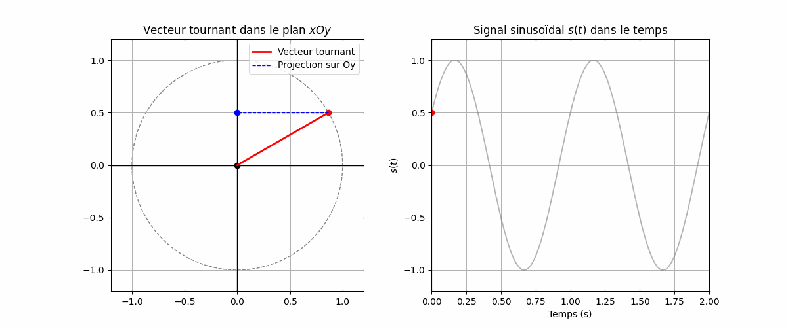

# Chapitre #2 - Superposition de deux signaux sinusoïdaux 
## -1 Notions – Représentation sinusoïdale (réelle et complexe)

Une fonction sinusoïdale peut être exprimée de deux manières :

### Forme réelle :

$$
s(t) = A \cos(\omega t + \varphi_0)
$$

Elle peut être interprétée comme la **projection sur l’axe $Ox$** d’un vecteur tournant dans le plan $xOy$, avec :

* **Amplitude** $A$ : la norme du vecteur.
* **Vitesse angulaire** $\omega$ (en $rad·s^{-1}$) : vitesse de rotation du vecteur autour de l’axe $Oz$.
* **Phase initiale** $\varphi_0$ : l’angle à l’instant $t = 0$.
* **Phase instantanée** $\omega t + \varphi_0$ : l’angle formé avec l’axe $Ox$ au temps $t$.

---

### Forme complexe (représentation de Fresnel, exponentielle complexe) :

$$
s(t) = \Re{ A e^{j(\omega t + \varphi_0)} }
$$

Dans cette forme :

* $j$ est l’unité imaginaire (avec $j^2 = -1$),
* $e^{j(\omega t + \varphi_0)}$ représente une **rotation dans le plan complexe** (appelée **phasor**),
* $\Re\{\cdot\}$ signifie qu’on prend la **partie réelle** du nombre complexe.

Cela permet :

* une **manipulation plus simple** (addition, dérivée, intégrale…),
* une **visualisation directe** dans le plan complexe $\mathbb{C}$,
* une base solide pour l’analyse fréquentielle (Fourier, filtrage…).

## -2 Propriétés de la somme de deux signaux sinusoïdaux

On peut ainsi obtenir, par construction graphique, la somme de deux fonctions sinusoïdales.

$$
s(t) = S_1 \times \cos(\omega t + \phi_1) + S_2 \times \cos(\omega t + \phi_2)
$$

## -3 Addition de deux signaux sinusoïdaux de même fréquence

### 1. Étude graphique

On peut visualiser la somme de deux vecteurs tournants représentant chacun un signal sinusoïdal. La somme vectorielle donne le signal résultant.

[code de visualisation : Somme signaux sinusoïdaux](Code%20Pythons/Somme_sinus.py)
### 2. Expression mathématique

Soient deux signaux :

$$
s_1(t) = S_1 \times \cos(\omega t + \phi_1)
$$

$$
s_2(t) = S_2 \times \cos(\omega t + \phi_2)
$$

On cherche à calculer la somme :

$$
S(t) = s_1(t) + s_2(t)
$$

**Définition :** Le signal résultant est un signal sinusoïdal de même pulsation $\omega$ et d'amplitude :

$$
A = \sqrt{S_1^2 + S_2^2 + 2 S_1 S_2 \cos(\phi_2 - \phi_1)}
$$

### 3. Étude de l’amplitude du signal résultant

L’amplitude du signal résultant dépend de la différence de phase $\phi_2 - \phi_1$.

#### a) Amplitude maximale

L’amplitude est maximale lorsque les deux signaux sont en phase, soit :

$$
\phi_2 - \phi_1 = n \times 2\pi
$$

Elle vaut alors :

$$
A_{\text{max}} = S_1 + S_2
$$

#### b) Amplitude minimale

L’amplitude est minimale lorsque les deux signaux sont en opposition de phase, soit :

$$
\phi_2 - \phi_1 = n \times 2\pi + \pi
$$

Elle vaut alors :

$$
A_{\text{min}} = |S_2 - S_1|
$$

## -4 Interférences

### A. Étude expérimentale : les fentes d’Young

#### 1. Expérience

Deux fentes fines, séparées par une distance $a$, sont éclairées par une même source lumineuse monochromatique. On observe les interférences produites sur un écran situé à une distance $d$ des fentes.

---

### B. Étude théorique

#### 1. Interférences constructives et destructives

On s’intéresse aux ondes progressives sinusoïdales émises par deux sources $s_1$ et $s_2$.

On suppose qu’elles ont une même amplitude $A$ et une même fréquence (période $T$, longueur d’onde $\lambda$).

Les perturbations en un point $M$ engendrées par ces deux ondes s’écrivent :

$$
\begin{cases}
u_1(r_1, t) = A \times \cos \left( 2 \pi \left(\frac{1}{T} t - \frac{r_1}{\lambda}\right) \right) \\
u_2(r_2, t) = A \times \cos \left( 2 \pi \left(\frac{1}{T} t - \frac{r_2}{\lambda}\right) \right)
\end{cases}
$$

où $r_1$ et $r_2$ sont les distances respectives des sources au point $M$.

---

## -5 Un modèle : l’onde progressive sinusoïdale

### A. Onde progressive

#### 1. Définition  
Une onde progressive est provoquée par un signal périodique entretenu. On note $T$ cette période.

#### 2. Double périodicité  
Une onde progressive présente une double périodicité :  
- **Périodicité temporelle** :  
  On observe un point particulier de la corde, on constate que l’on retrouve le même état (même valeur $u$) à des dates séparées par des multiples entiers de $T$.  
- **Périodicité spatiale** :  
  Au même instant, certains points de la corde sont dans un même état (même valeur de $u$), ces points sont séparés par des distances égales à des multiples entiers de la longueur d’onde $\lambda$.

> Fondamental : La période et la longueur d’onde sont liées à la célérité $c$ par la relation :  
$$
\lambda = c \times T
$$

---

### B. Onde progressive sinusoïdale

#### 1. Expression mathématique  

Une onde progressive sinusoïdale est décrite par la perturbation à la source :  
$$
u(0,t) = f_0(t) = A \times \cos(\omega t + \varphi_0)
$$
- $A$ : amplitude  
- $\omega$ : pulsation, liée à la fréquence $f$ et la période $T$ par $\omega = 2\pi f = \frac{2\pi}{T}$  
- $\varphi_0$ : phase initiale  

En un point $x$ de la corde, la perturbation arrive avec un retard $\theta = \frac{x}{c}$, donc :  
$$
u(x,t) = A \times \cos \left( \omega \left(t - \frac{x}{c}\right) + \varphi_0 \right) 
= A \times \cos \left(\omega t - k x + \varphi_0 \right)
$$
avec  
$$
k = \frac{\omega}{c} = \frac{2\pi}{\lambda}
$$

---

#### 2. Double périodicité  

- Vecteur d'onde :  
$$
\vec{R} = \frac{\omega}{c}
$$
- Nombre d'onde :  
$$
\theta = \frac{1}{\lambda}
$$

On remarque que $u(x,t)$ reprend la même valeur dès que l’argument du cosinus varie de $2\pi$.  

Périodicité temporelle :  
$$
T = \frac{2\pi}{\omega} = \frac{1}{f}
$$

Périodicité spatiale :  
$$
\lambda = \frac{2\pi}{k} = \frac{1}{\theta} = c T
$$

| Dimension | Période | Fréquence | Pulsation |
|-----------|---------|-----------|-----------|
| Temps     | $T$   | $f$     | $\omega$|
| Espace    | $\lambda$ | $\theta$ | $k$    |

---

#### 3. Déphasage entre deux points  

La phase à l’abscisse $x$ est :  
$$
\varphi(x) = \varphi_0 - k x
$$

Le déphasage entre deux points $x_1$ et $x_2$ est :  
$$
\varphi(x_2) - \varphi(x_1) = -k (x_2 - x_1) = - \frac{2\pi}{\lambda} (x_2 - x_1)
$$

- Deux points vibrent **en phase** si :  
$$
\varphi(x_2) - \varphi(x_1) = m \times 2\pi \quad \Rightarrow \quad x_2 - x_1 = m \lambda, \quad m \in \mathbb{Z}
$$

- Deux points vibrent **en opposition de phase** si :  
$$
\varphi(x_2) - \varphi(x_1) = \left(m + \frac{1}{2}\right) \times 2\pi \quad \Rightarrow \quad x_2 - x_1 = \left(m + \frac{1}{2}\right) \lambda
$$

[Calcul de déphasage](Code%20Pythons/calcul_dephasage.py)

---

### C. Intérêt du modèle sinusoïdal

1. Théorème de Fourier  
2. Décomposition spectrale d’un signal périodique  
3. Exemple : signaux sonores  

